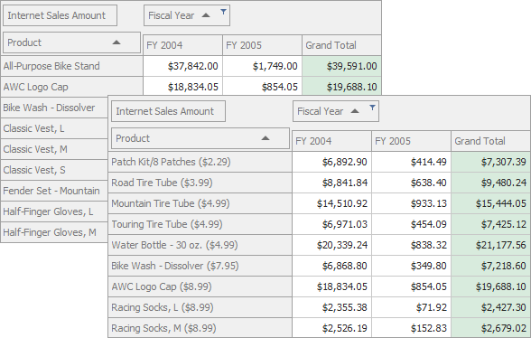

<!-- default badges list -->

<!-- default badges end -->

# Pivot Grid for WinForms - Custom Sorting in OLAP

This example demonstrates how to handle the [CustomServerModeSort](https://docs.devexpress.com/WindowsForms/DevExpress.XtraPivotGrid.PivotGridControl.CustomServerModeSort?v=22.2) event to sort data by [e.OLAPMember](https://docs.devexpress.com/CoreLibraries/DevExpress.XtraPivotGrid.CustomServerModeSortEventArgsBase-1.OLAPMember1?v=22.2) properties.

In this example, the _Product_ field values are sorted by the "List Price" OLAP member property. The "List Price" member property values are displayed near the _Products_ field values.

## Files to Review 

[Form1.cs](./CS/WinFormsPivotGridCustomOLAPSort/Form1.cs) (VB: [Form1.vb](./VB/WinFormsPivotGridCustomOLAPSort/Form1.vb))

## Documentation

[Sorting Data](https://docs.devexpress.com/WindowsForms/1952/controls-and-libraries/pivot-grid/data-shaping/sorting/sorting-data)

## More Examples 

[Pivot Grid for WinForms - How to Use a Hidden Field to Sort the Visible Field Values](https://github.com/DevExpress-Examples/winforms-pivot-grid-use-a-hidden-field-to-sort-visible-field-values)

